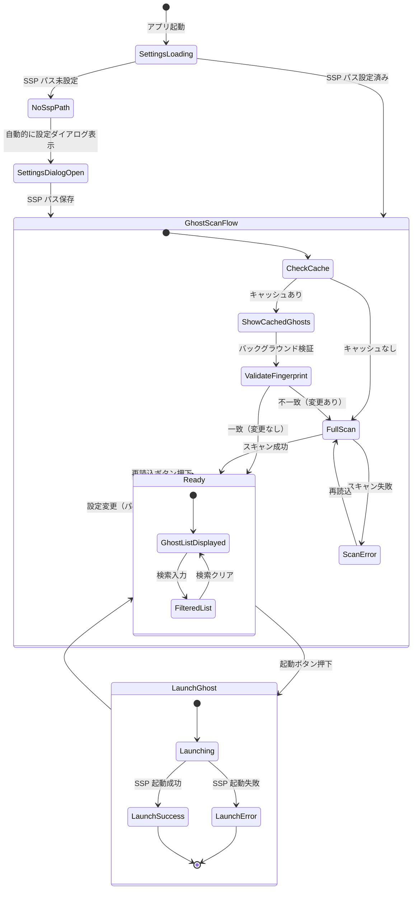
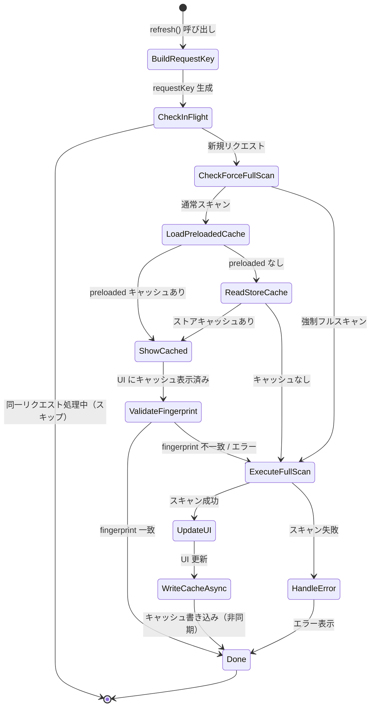
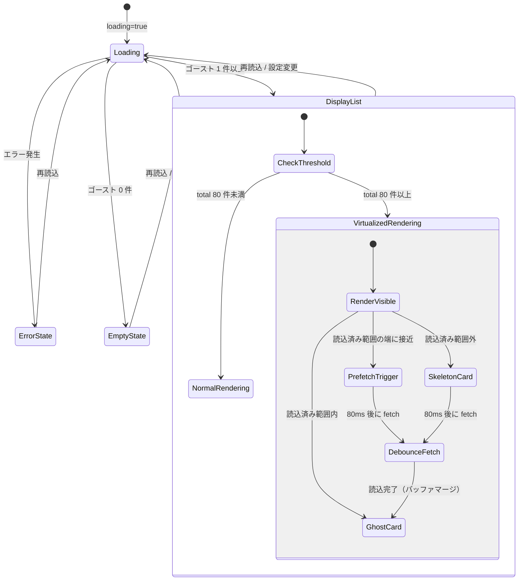

# Ghost Launcher 仕様書

## 1. プロジェクト概要

Ghost Launcher は、**伺か/SSP ゴースト**を検出・一覧表示・検索・起動するための Windows 向けデスクトップランチャーアプリケーションである。

- **対象ユーザー**: 伺か/SSP を利用しているユーザー
- **動作環境**: Windows（WebView2 ランタイム + VC++ ランタイム + SSP 本体が必要）
  - ※ SSP自体がWindows専用であるため、本アプリのクロスプラットフォーム展開は想定せず、Windows限定とする。
- **技術構成**: Tauri 2（Rust バックエンド）+ React 19 / TypeScript フロントエンド + Fluent UI v9

---

## 2. 機能一覧

| ID   | 機能名                     | 概要                                                                                |
| ---- | -------------------------- | ----------------------------------------------------------------------------------- |
| F-01 | SSP フォルダ設定           | `ssp.exe` を含むフォルダをダイアログで選択・永続化                                  |
| F-02 | 追加フォルダ管理           | SSP 外のゴーストフォルダを追加・削除・永続化                                        |
| F-03 | ゴーストスキャン           | SSP フォルダ + 追加フォルダ内のゴーストを走査し `descript.txt` からメタデータを解析 |
| F-04 | フィンガープリント差分検知 | ディレクトリ構成・更新時刻のハッシュでスキャン結果の変化を検出                      |
| F-05 | ゴーストキャッシュ         | スキャン結果を SQLite に永続化し、fingerprint を `localStorage` に保持して差分検知 |
| F-06 | ゴースト検索               | SQLite に対する名前・ディレクトリ名の部分一致検索                                   |
| F-07 | ゴースト起動               | SSP を `/g` オプション付きで起動（SSP 内: ディレクトリ名、外部: フルパス指定）      |
| F-08 | 仮想スクロール             | 80件以上で仮想化。全件数で固定スクロール空間を確保し、バッファマージ方式で先読み読込 |
| F-09 | テーマ追従                 | OS のライト/ダークテーマに自動追従（Fluent UI）                                     |
| F-10 | ウィンドウ状態保存         | `tauri-plugin-window-state` によるウィンドウ位置・サイズの永続化                    |

---

## 3. アーキテクチャ

### 3.1 全体構成

```
┌──────────────────────────────────────────────────────┐
│                    Tauri Shell                        │
│  ┌─────────────────────┐  ┌────────────────────────┐ │
│  │  Rust バックエンド    │  │  React フロントエンド    │ │
│  │                     │  │                        │ │
│  │  commands/           │  │  App.tsx               │ │
│  │   ghost/            │◄─┤   hooks/               │ │
│  │     scan.rs         │  │   lib/                 │ │
│  │     fingerprint.rs  │  │   components/          │ │
│  │   ssp.rs            │  │                        │ │
│  │  utils/             │  │  Fluent UI v9          │ │
│  │   descript.rs       │  │  @tauri-apps/api       │ │
│  └─────────────────────┘  └────────────────────────┘ │
│                                                      │
│  Plugins: dialog, store, window-state                │
└──────────────────────────────────────────────────────┘
         │                           │
         ▼                           ▼
   ファイルシステム              SQLite + localStorage
   (ghost/ ディレクトリ)        (ゴースト一覧 + fingerprint)
```

### 3.2 バックエンド（Rust）モジュール構成

| ファイル                        | 責務                                                                                 |
| ------------------------------- | ------------------------------------------------------------------------------------ |
| `lib.rs`                        | Tauri アプリビルダー。コマンド・プラグイン登録                                       |
| `main.rs`                       | エントリポイント（`ghost_launcher_lib::run()` 呼び出し）                             |
| `commands/ghost/mod.rs`         | `scan_ghosts_with_meta`・`get_ghosts_fingerprint` Tauri コマンド公開                 |
| `commands/ghost/scan.rs`        | ゴーストディレクトリ走査＋フィンガープリントトークン同時収集                         |
| `commands/ghost/fingerprint.rs` | フィンガープリント専用計算（`build_fingerprint`）＋ハッシュ生成                      |
| `commands/ghost/path_utils.rs`  | パス正規化（`\` → `/`、小文字化）                                                    |
| `commands/ghost/types.rs`       | `Ghost`・`ScanGhostsResponse` 型定義                                                 |
| `commands/ssp.rs`               | `launch_ghost` コマンド（`ssp.exe /g {ghost}` を起動）                               |
| `utils/descript.rs`             | `descript.txt` パーサー（UTF-8 BOM / charset フィールド / Shift_JIS フォールバック） |

### 3.3 フロントエンド（React/TypeScript）モジュール構成

| ファイル                   | 責務                                                                     |
| -------------------------- | ------------------------------------------------------------------------ |
| `main.tsx`                 | ルートレンダリング。FluentProvider でテーマ設定                          |
| `App.tsx`                  | アプリ全体のレイアウト・状態管理の統合                                   |
| `types/index.ts`           | 共有型定義（`Ghost`, `GhostView`, `ScanGhostsResponse`, キャッシュ型）   |
| **lib/**                   |                                                                          |
| `settingsStore.ts`         | `LazyStore("settings.json")` のシングルトン                              |
| `ghostScanClient.ts`       | Tauri `invoke` ラッパー（`scanGhostsWithMeta`, `getGhostsFingerprint`）  |
| `ghostScanOrchestrator.ts` | キャッシュ検証・重複排除付きスキャン実行                                 |
| `ghostScanUtils.ts`        | パス正規化・リクエストキー生成・エラーメッセージ構築                     |
| `ghostCacheRepository.ts`  | ゴーストキャッシュの読み書き（キュー化による直列書き込み）               |
| `ghostLaunchUtils.ts`      | 起動エラーメッセージ構築・ソースフォルダラベル取得                       |
| **hooks/**                 |                                                                          |
| `useSettings.ts`           | 設定（`ssp_path`, `ghost_folders`）の読み込み・更新・永続化              |
| `useGhosts.ts`             | ゴーストスキャン・キャッシュ管理・状態提供                               |
| `useSearch.ts`             | SQLite 部分一致検索。バッファマージモデル（隣接/重複範囲をマージし旧データを保持） |
| `useVirtualizedList.ts`    | 仮想スクロール計算。`totalCount` で固定スクロール空間を確保              |
| `useElementHeight.ts`      | ResizeObserver による要素高さ追跡                                        |
| `useSystemTheme.ts`        | OS テーマ（light/dark）検出・追従                                        |
| **components/**            |                                                                          |
| `AppHeader.tsx`            | タイトル・再読込ボタン・設定ボタン                                       |
| `SettingsPanel.tsx`        | SSP フォルダ選択・追加フォルダ管理 UI                                    |
| `GhostContent.tsx`         | ゴースト一覧エリア（検索ボックス + リスト）のコンテナ                    |
| `GhostList.tsx`            | ゴーストリスト表示（仮想スクロール・スケルトン描画・debounce fetch）     |
| `GhostCard.tsx`            | 個別ゴースト表示カード（名前・ディレクトリ名・ソースバッジ・起動ボタン） |
| `SkeletonCard.tsx`         | 未読込領域のプレースホルダーカード（Fluent UI Skeleton）                  |
| `SearchBox.tsx`            | 検索入力フィールド                                                       |

---

## 4. データモデル

### 4.1 Ghost（Rust / TypeScript 共通）

| フィールド       | 型       | 説明                                                                            |
| ---------------- | -------- | ------------------------------------------------------------------------------- |
| `name`           | `String` | `descript.txt` の `name` フィールド（未定義時はディレクトリ名にフォールバック） |
| `directory_name` | `String` | ゴーストのディレクトリ名                                                        |
| `path`           | `String` | ゴーストのフルパス                                                              |
| `source`         | `String` | `"ssp"`（SSP 内ゴースト）またはフォルダのフルパス（追加フォルダ）               |

### 4.2 GhostView（フロントエンド拡張）

`Ghost` に加えて以下を持つ:

| フィールド             | 型       | 説明                                  |
| ---------------------- | -------- | ------------------------------------- |
| `name_lower`           | `string` | `name` の小文字版（検索用）           |
| `directory_name_lower` | `string` | `directory_name` の小文字版（検索用） |

### 4.3 GhostCacheStoreV1（永続化キャッシュ）

```json
{
  "version": 1,
  "entries": {
    "<request_key>": {
      "request_key": "c:/ssp::c:/extra_ghosts",
      "fingerprint": "0123456789abcdef",
      "ghosts": [
        /* Ghost[] */
      ],
      "cached_at": "2026-02-24T12:00:00.000Z"
    }
  }
}
```

### 4.4 設定ストア（settings.json）

| キー             | 型                  | 説明                         |
| ---------------- | ------------------- | ---------------------------- |
| `ssp_path`       | `string`            | SSP インストールフォルダパス |
| `ghost_folders`  | `string[]`          | 追加ゴーストフォルダの配列   |
| `ghost_cache_v1` | `GhostCacheStoreV1` | ゴーストキャッシュ           |

---

## 5. ゴーストディレクトリ構造

ゴーストは以下の規則に従って検出される:

```
{parent}/
  {ghost_name}/          ← ゴーストディレクトリ（directory_name）
    ghost/
      master/
        descript.txt     ← メタデータファイル
```

- **SSP 内ゴースト**: `{ssp_path}/ghost/{ghost_name}/ghost/master/descript.txt`
- **追加フォルダのゴースト**: `{additional_folder}/{ghost_name}/ghost/master/descript.txt`

### 5.1 descript.txt の解析

- **フォーマット**: CSV ライク（`key,value` のカンマ区切り、1行1エントリ）
- **コメント**: `//` で始まる行は無視
- **空行**: 無視
- **文字コード判定順序**:
  1. UTF-8 BOM（`0xEF 0xBB 0xBF`）→ UTF-8
  2. 先頭 4096 バイト内の `charset` フィールド → 指定コードで全体デコード
  3. フォールバック → Shift_JIS

---

## 6. Tauri コマンド仕様

### 6.1 `scan_ghosts_with_meta`

| 項目   | 内容                                                                                             |
| ------ | ------------------------------------------------------------------------------------------------ |
| 引数   | `ssp_path: String`, `additional_folders: Vec<String>`                                            |
| 戻り値 | `ScanGhostsResponse { ghosts: Vec<Ghost>, fingerprint: String }`                                 |
| 処理   | SSP の `ghost/` ディレクトリと追加フォルダを走査し、ゴースト一覧とフィンガープリントを同時に返す |
| ソート | `name` の大文字小文字無視の辞書順                                                                |
| エラー | SSP の `ghost/` フォルダ不在時にエラー。追加フォルダの不在・読取不能は無視して続行               |

### 6.2 `get_ghosts_fingerprint`

| 項目   | 内容                                                                                                                                 |
| ------ | ------------------------------------------------------------------------------------------------------------------------------------ |
| 引数   | `ssp_path: String`, `additional_folders: Vec<String>`                                                                                |
| 戻り値 | `String`（64桁16進数ハッシュ、SHA-256）                                                                                              |
| 処理   | ゴーストディレクトリ構成の変化検知用フィンガープリントを返す。ゴースト内容は読まず、ディレクトリとファイルの存在・更新時刻のみで計算 |

### 6.3 `launch_ghost`

| 項目   | 内容                                                                                                                                                            |
| ------ | --------------------------------------------------------------------------------------------------------------------------------------------------------------- |
| 引数   | `ssp_path: String`, `ghost_directory_name: String`, `ghost_source: String`                                                                                      |
| 戻り値 | `()`                                                                                                                                                            |
| 処理   | `ssp.exe /g {ghost_arg}` を起動。SSP 内ゴースト（`source == "ssp"`）はディレクトリ名のみ、外部ゴーストは `{source}/{directory_name}` のフルパスを渡す           |
| 非同期 | `Command::spawn()` で起動し、プロセス終了を待たず即座に処理を返す。複数インスタンスの起動制御や重複起動防止はランチャー側で行わず、SSP 側（本体機能）に一任する |
| エラー | `ssp.exe` 不在時・起動失敗時にエラー                                                                                                                            |

---

## 7. フィンガープリント仕様

### 7.1 トークン構成

フィンガープリントは以下のトークン文字列の集合から計算される:

| トークン形式                                                                                           | 説明                           |
| ------------------------------------------------------------------------------------------------------ | ------------------------------ |
| `fingerprint-version\|1`                                                                               | バージョンヘッダ               |
| `parent\|{label}\|{normalized_path}\|{modified_nanos}`                                                 | 親ディレクトリの更新時刻       |
| `parent\|{label}\|{normalized_path}\|missing`                                                          | 存在しない追加フォルダ         |
| `parent\|{label}\|{normalized_path}\|not-directory`                                                    | ディレクトリでない追加フォルダ |
| `entries\|{label}\|{normalized_path}\|unreadable`                                                      | 読取不能なディレクトリ         |
| `entry\|{label}\|{normalized_path}\|{dir_name}\|{dir_modified}\|{descript_state}\|{descript_modified}` | 個別ゴーストエントリ           |

### 7.2 ハッシュ計算

1. 全トークンをソート
2. SHA-256 でトークンを順番に update（トークン間に `\n` を挿入して境界混同を防止）
3. 64桁16進数文字列（SHA-256）として出力

### 7.3 追加フォルダの正規化

- パスの `\` を `/` に統一し小文字化
- 重複排除後、正規化パスの辞書順でソート（順序非依存性を保証）

---

## 8. キャッシュ戦略

### 8.1 キャッシュフロー

1. **refresh開始**: `requestKey` を生成し、同一キーの in-flight リクエストを抑止
2. **キャッシュ検証準備**: `localStorage[fingerprint_${requestKey}]` と SQLite のデータ有無を確認
3. **検証**: `get_ghosts_fingerprint` を呼び出し fingerprint 一致を判定
4. **一致**: スキャン不要（`useSearch` が SQLite から一覧を取得）
5. **不一致/未保持/強制更新**: フルスキャンを実行
6. **保存**: スキャン結果を SQLite へ置換保存し、成功時のみ fingerprint を更新

### 8.2 責務分離方針

- `hooks/useGhosts.ts`
  - React 状態（loading / error）と画面からの `refresh` トリガのみを担当
- `lib/ghostCatalogService.ts`
  - キャッシュ判定、スキャン実行、SQLite 保存、fingerprint 更新のユースケース手順を担当
- `lib/fingerprintCache.ts`
  - `localStorage` への fingerprint 読み書き抽象化を担当

### 8.3 強制リフレッシュ

ヘッダーの「再読込」ボタンはキャッシュ検証をスキップし、即座にフルスキャンを実行する。

### 8.4 重複排除

同一 `requestKey` に対する並行スキャンリクエストは共有される（`pendingScans` Map）。

---

## 9. 状態遷移図

### 9.1 アプリケーション全体の状態遷移



### 9.2 ゴーストスキャンの詳細状態遷移



### 9.3 GhostList コンポーネントの表示状態



---

## 10. UI 構成

### 10.1 画面構成

```
┌──────────────────────────────────────┐
│ AppHeader                            │
│  「Ghost Launcher」  [再読込] [設定]  │
├──────────────────────────────────────┤
│ GhostContent                         │
│  ┌──────────────────────┐            │
│  │ SearchBox             │            │
│  │ [🔍 ゴースト名で検索]  │            │
│  └──────────────────────┘            │
│  「N 体のゴースト」                    │
│  ┌──────────────────────────────────┐│
│  │ GhostCard                        ││
│  │  ゴースト名        [起動]         ││
│  │  directory_name [ソースバッジ]     ││
│  ├──────────────────────────────────┤│
│  │ GhostCard                        ││
│  │  ...                             ││
│  └──────────────────────────────────┘│
└──────────────────────────────────────┘

        設定ダイアログ（モーダル）
┌──────────────────────────────────────┐
│ 設定                                  │
│  SSP フォルダ: [         ] [選択]      │
│                                      │
│  追加ゴーストフォルダ           [追加]  │
│  ┌──────────────────────────────────┐│
│  │ C:\Ghosts\Extra        [削除]    ││
│  │ D:\MyGhosts            [削除]    ││
│  └──────────────────────────────────┘│
│                             [閉じる]  │
└──────────────────────────────────────┘
```

> **Note (ウィンドウ初期表示タイミング):**
> 起動時の目障りなチラつき（デフォルト位置に表示された直後に保存された位置へジャンプする現象）を防止するため、`tauri.conf.json` では `"visible": false` を設定している。ウィンドウは表示状態・位置を復元する `tauri-plugin-window-state` の処理が完了したタイミングで自動的に可視化される。

### 10.2 レスポンシブ対応

- 最大幅: 960px（中央寄せ）
- ウィンドウ最小幅: 520px、最小高: 560px
- 600px 以下でグリッドを 1 カラムに崩す

### 10.3 テーマ

- OS の `prefers-color-scheme` に追従
- Fluent UI の `webLightTheme` / `webDarkTheme` を切り替え

---

## 11. CI/CD

### 11.1 CI ビルド（`ci-build.yml`）

- トリガー: `main` への push・PR
- 実行環境: `windows-latest`
- ステップ: `npm run build` → `check:ui-guidelines` → `test:ui-guidelines-check` → `cargo check`

### 11.2 リリース（`release.yml`）

- トリガー: `v*` タグ push
- 実行環境: `windows-latest`
- ステップ: `npx tauri build --no-bundle` → ポータブル ZIP 作成 → GitHub Release 作成（自動リリースノート）

---

## 12. 設定ファイル仕様

### 12.1 永続化方法

`@tauri-apps/plugin-store` の `LazyStore` を使用。ファイルは Tauri のアプリデータディレクトリ内の `settings.json` に保存される。

### 12.2 設定保存のタイミング

- SSP パス変更: 即時 `set` + `save`
- 追加フォルダ追加/削除: 楽観的 UI 更新 → 永続化失敗時はロールバック

---

## 13. エラーハンドリング方針

| 場面                                 | 挙動                                                     |
| ------------------------------------ | -------------------------------------------------------- |
| SSP の `ghost/` フォルダ不在         | Rust 側でエラー返却 → フロントエンドでエラー表示         |
| 追加フォルダ不在・読取不能           | 無視して続行（フィンガープリントにはトークンとして記録） |
| `descript.txt` 不在                  | そのゴーストをスキップ                                   |
| `descript.txt` に `name` 未定義      | ディレクトリ名をフォールバック表示名とする               |
| `ssp.exe` 不在                       | 起動時エラー表示（`role="alert"`）                       |
| スキャンエラー（キャッシュ表示済み） | キャッシュ表示を維持し、エラーを抑制                     |
| スキャンエラー（キャッシュなし）     | エラーメッセージ表示 + ゴーストリストクリア              |
| 設定保存失敗                         | コンソールエラー + UI ロールバック                       |
| キャッシュ書き込み失敗               | コンソールエラーのみ（UI 影響なし）                      |

---
