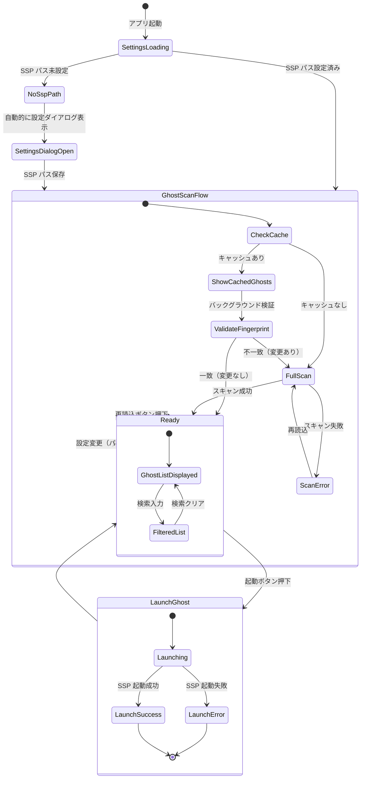
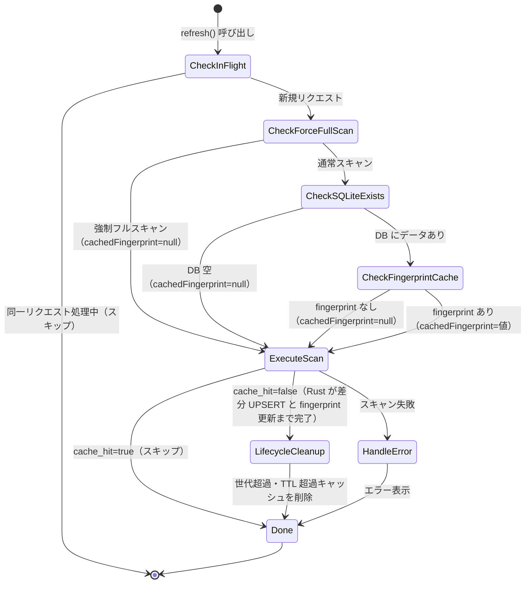
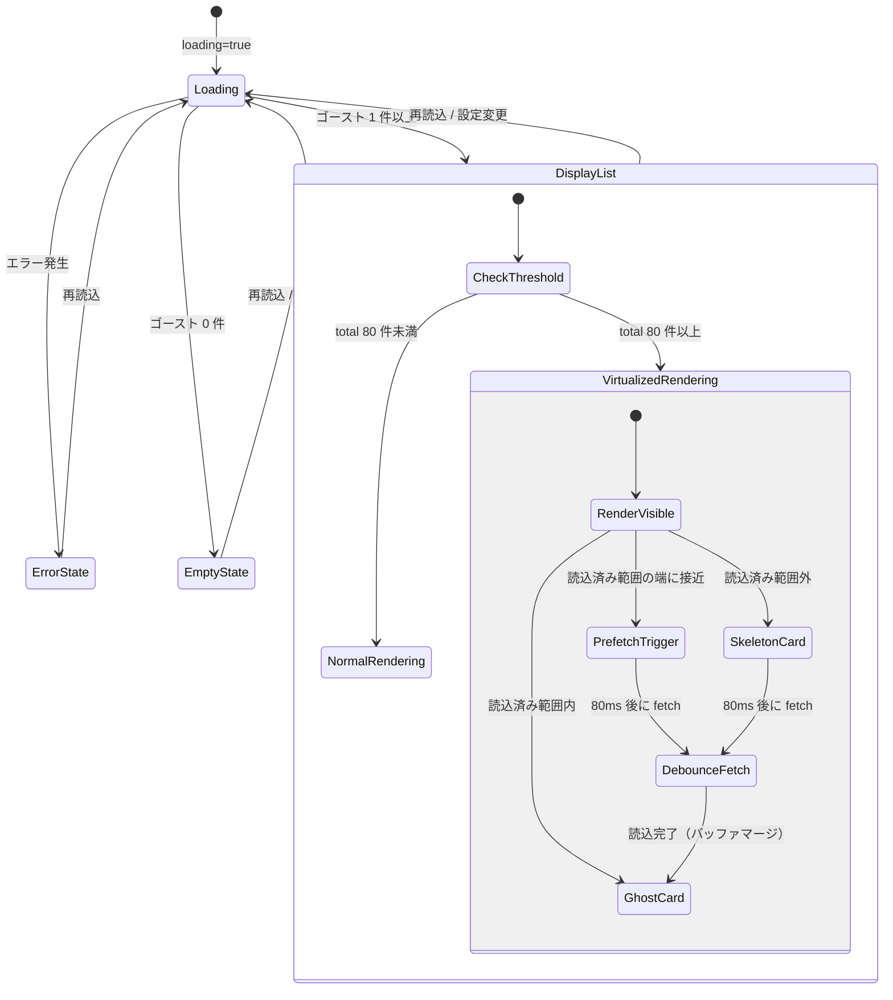

# Ghost Launcher 仕様書

## 1. プロジェクト概要

Ghost Launcher は、**伺か/SSP ゴースト**を検出・一覧表示・検索・起動するための Windows 向けデスクトップランチャーアプリケーションである。

- **対象ユーザー**: 伺か/SSP を利用しているユーザー
- **動作環境**: Windows（WebView2 ランタイム + VC++ ランタイム + SSP 本体が必要）
  - ※ SSP自体がWindows専用であるため、本アプリのクロスプラットフォーム展開は想定せず、Windows限定とする。
- **技術構成**: Tauri 2（Rust バックエンド）+ React 19 / TypeScript フロントエンド + Fluent UI v9

---

## 2. 機能一覧

| ID   | 機能名                     | 概要                                                                                |
| ---- | -------------------------- | ----------------------------------------------------------------------------------- |
| F-01 | SSP フォルダ設定           | `ssp.exe` を含むフォルダをダイアログで選択・永続化                                  |
| F-02 | 追加フォルダ管理           | SSP 外のゴーストフォルダを追加・削除・永続化                                        |
| F-03 | ゴーストスキャン           | SSP フォルダ + 追加フォルダ内のゴーストを走査し `descript.txt` からメタデータを解析 |
| F-04 | フィンガープリント差分検知 | ディレクトリ構成・更新時刻のハッシュでスキャン結果の変化を検出                      |
| F-05 | ゴーストキャッシュ         | スキャン結果と fingerprint を SQLite に永続化して差分検知。世代数（最新 5 世代）と TTL（30 日）による寿命管理で肥大化を防止 |
| F-06 | ゴースト検索               | SQLite に対する名前・ディレクトリ名の部分一致検索                                   |
| F-07 | ゴースト起動               | SSP を `/g` オプション付きで起動（SSP 内: ディレクトリ名、外部: フルパス指定）      |
| F-08 | 仮想スクロール             | 80件以上で仮想化。全件数で固定スクロール空間を確保し、バッファマージ方式で先読み読込 |
| F-09 | テーマ追従                 | OS のライト/ダークテーマに自動追従（Fluent UI）                                     |
| F-10 | ウィンドウ状態保存         | `tauri-plugin-window-state` によるウィンドウ位置・サイズの永続化                    |
| F-11 | ソート順切替               | 名前順・最近起動順・起動回数順・ランダム順の切替。最近起動順・起動回数順は `ghosts` の非正規化集計列（`last_launched`/`launch_count`）を基盤とし、起動履歴の権威は `user-data.db`（永続）の `ghost_launches` が持つ |
| F-12 | ランダム起動               | 一覧から無作為に 1 体選んで起動するボタン                                           |
| F-13 | 起動履歴記録               | ゴースト起動時に ghost_identity_key と起動日時を永続記録                            |

---

## 3. アーキテクチャ

### 3.1 全体構成

```
┌───────────────────────────────────────────────────────┐
│                     Tauri Shell                        │
│  ┌──────────────────────┐  ┌────────────────────────┐ │
│  │  Rust バックエンド     │  │  React フロントエンド    │ │
│  │                      │  │                        │ │
│  │  commands/            │  │  App.tsx               │ │
│  │   ghost/             │◄─┤   hooks/               │ │
│  │     scan.rs          │  │   lib/                 │ │
│  │     fingerprint.rs   │  │   components/          │ │
│  │   ssp.rs             │  │                        │ │
│  │   locale.rs          │  │  Fluent UI v9          │ │
│  │  actor/ (DB writer)  │  │                        │ │
│  │                      │  │  @tauri-apps/api       │ │
│  └──────────┬───────────┘  └────────────────────────┘ │
│             │                                         │
│  ┌──────────▼───────────┐                             │
│  │  crates/ghost-meta/  │  ← ワークスペースクレート     │
│  │   descript / ghost   │                             │
│  │   thumbnail          │                             │
│  └──────────────────────┘                             │
│                                                       │
│  Plugins: dialog, store, window-state, sql            │
└───────────────────────────────────────────────────────┘
         │                           │
         ▼                           ▼
   ファイルシステム         ghosts.db（揮発キャッシュ）+ user-data.db（永続）
   (ghost/ ディレクトリ)   （ゴースト一覧 + fingerprint / 起動履歴）+ localStorage
```

### 3.2 バックエンド（Rust）構成

**`src-tauri/src/`（Tauri コマンド層）**

| モジュール          | 責務                                                                                     |
| ------------------- | ---------------------------------------------------------------------------------------- |
| `lib.rs`            | Tauri アプリビルダー。コマンド・プラグイン登録。setup 内で DB アクター起動配線（`actor::bootstrap`）を実行し、失敗時は起動中止（fail-fast） |
| `actor/`            | ghosts.db/user-data.db への全書き込みを直列化する単一 writer アクター。`mod.rs`: `Job` enum（Scan/RecordLaunch/CleanupCaches/Maintenance）と受信ループ、`db_path.rs`: ghosts.db パス解決の単一権威（アクター専有可視性） |
| `cache_schema.rs`   | ghosts.db の使い捨てスキーマ管理。`CACHE_SCHEMA` が単一権威で、そのハッシュを `PRAGMA user_version` に刻み、不一致時は起動時に単一トランザクションで自動リビルドする |
| `commands/ghost/`   | ゴーストスキャン一式: 走査と型変換・差分検知（scan）・差分 delta 書込とキャッシュ寿命管理（store）・二層フィンガープリント（fingerprint）・パス正規化（path_utils）・型定義（types） |
| `commands/ssp.rs`   | SSP 連携: ゴースト起動（launch_ghost）・SSP パス検証（validate_ssp_path）                 |
| `commands/launch_history.rs` | 起動履歴記録の本体（アクター RecordLaunch ジョブから呼ばれる `record_launch_inner`）と user-data.db 管理: 履歴 INSERT ＋ ghosts 集計列 bump・スキャン時の集計列 backfill・旧 ghosts.db 履歴の移送 |
| `commands/locale.rs`| ユーザー言語ファイル読込                                                                  |

**`crates/ghost-meta/`（ゴーストメタデータ解析クレート）**

descript.txt のパース（文字コード判定含む）・単体ゴースト読込・サムネイル解決を提供する。
ファイル構成と公開 API はクレートのソースを権威とする。

### 3.3 フロントエンド（React/TypeScript）構成

| レイヤー      | 責務                                                                                       |
| ------------- | ------------------------------------------------------------------------------------------ |
| `lib/`        | Tauri IPC ラッパー（スキャン・起動・検証・cleanup）・SQLite 読み取り専用アクセス（SQL 書込は行わず、書込は全て IPC 経由で Rust の DB アクターへ委譲）・キャッシュ判定と寿命管理・設定ストア・i18n 初期化・DB 監視ログ |
| `hooks/`      | React 状態と lib の橋渡し（設定・スキャン・検索・仮想スクロール・テーマ・シェル状態）        |
| `components/` | 表示のみ。IPC を直接呼ばず、lib / hooks 経由でデータを受け取る                              |
| `types/`      | TS 専用型（GhostView・SortOrder 等）と ts-rs 生成型（types/generated/、手書き禁止）         |

依存方向は `components → hooks → lib → IPC` の一方向。ファイル毎の関数名は列挙しない
（実装事実はコードと `src/CLAUDE.md` が権威）。

---

## 4. データモデル

### 4.1 Ghost（Rust 内部型）

| フィールド                   | 型        | 説明                                                                            |
| ---------------------------- | --------- | ------------------------------------------------------------------------------- |
| `name`                       | `String`  | `descript.txt` の `name` フィールド（未定義時はディレクトリ名にフォールバック） |
| `sakura_name`                | `String`  | `descript.txt` の `sakura.name`（\0 キャラ名）。未設定時は空文字列             |
| `kero_name`                  | `String`  | `descript.txt` の `kero.name`（\1 キャラ名）。未設定時は空文字列               |
| `craftman`                   | `String`  | `descript.txt` の `craftman`（作者名）。未設定時は空文字列                      |
| `craftmanw`                  | `String`  | `descript.txt` の `craftmanw`（作者名 URL）。未設定時は空文字列                 |
| `directory_name`             | `String`  | ゴーストのディレクトリ名                                                        |
| `path`                       | `String`  | ゴーストのフルパス                                                              |
| `source`                     | `String`  | `"ssp"`（SSP 内ゴースト）またはフォルダのフルパス（追加フォルダ）               |
| `thumbnail_path`             | `String`  | サムネイル画像のフルパス。存在しない場合は空文字列                              |
| `thumbnail_use_self_alpha`   | `bool`    | `true` = PNG アルファチャンネル透過、`false` = 左上ピクセルをキーカラーとして透過。判定は実画像の color type を優先し、アルファチャンネルを持つ（RGBA / グレースケール+アルファ）場合は descript の `seriko.use_self_alpha` 宣言に関わらず `true`。持たない場合のみ宣言に従う。加えてフロントは `false` でも左上ピクセルが不透明でなければキー色抜きを行わず native alpha を尊重する（黒消え防止の多層防御） |
| `thumbnail_kind`             | `String`  | `"surface"` / `"thumbnail"` / `""`（サムネイルなし）                            |
| `diff_fingerprint`           | `String`  | 差分更新判定用の軽量フィンガープリント（メタデータ全フィールドの SHA-256）       |

IPC を渡らない走査結果の内部表現。DB への書き込みは rusqlite がフィールド単位で行う。

### 4.2 GhostView（フロントエンド表示型）

SQLite `ghosts` テーブルからの SELECT 結果を表す型（`diff_fingerprint` 等の内部カラムは含まない）。
選択列は `src/test/fixtures/ghost-view-columns.json` を単一権威として、TS 型・SELECT 文・DB スキーマの
三者が機械照合される（TS コンパイル時検査 + vitest + cargo test）。

`Ghost`（§4.1）のメタデータフィールドに加えて、NFKC 正規化・小文字版の検索用 6 列
（`name_lower` / `sakura_name_lower` / `kero_name_lower` / `craftman_lower` /
`craftmanw_lower` / `directory_name_lower`）と、永続参照キー `ghost_identity_key` を持つ。

### 4.3 ghosts テーブル（SQLite 揮発キャッシュ）

| カラム名                 | 型        | 説明                                                     |
| ------------------------ | --------- | -------------------------------------------------------- |
| `id`                     | `INTEGER` | PRIMARY KEY AUTOINCREMENT                                |
| `name`                   | `TEXT`    | ゴースト名                                               |
| `directory_name`         | `TEXT`    | ゴーストのディレクトリ名                                 |
| `path`                   | `TEXT`    | ゴーストのフルパス                                       |
| `source`                 | `TEXT`    | `"ssp"` またはフォルダフルパス                           |
| `name_lower`             | `TEXT`    | `name` の NFKC 正規化・小文字版（検索用）                |
| `directory_name_lower`   | `TEXT`    | `directory_name` の NFKC 正規化・小文字版（検索用）      |
| `request_key`            | `TEXT`    | SSP パスと追加フォルダからフロントエンドが生成した識別子  |
| `updated_at`             | `TEXT`    | 行の最終更新日時（INSERT 時に `CURRENT_TIMESTAMP`）      |
| `craftman`               | `TEXT`    | 作者名                                                   |
| `thumbnail_path`         | `TEXT`    | サムネイル画像パス                                       |
| `thumbnail_use_self_alpha` | `INTEGER` | 透過方式（1 = SelfAlpha, 0 = KeyColor）               |
| `thumbnail_kind`         | `TEXT`    | サムネイル種別（`"surface"` / `"thumbnail"` / `""`）     |
| `ghost_identity_key`     | `TEXT`    | ゴースト一意キー（差分更新用）                           |
| `row_fingerprint`        | `TEXT`    | 行レベルフィンガープリント（差分更新判定用）             |
| `sakura_name`            | `TEXT`    | \0 キャラ名                                              |
| `kero_name`              | `TEXT`    | \1 キャラ名                                              |
| `craftmanw`              | `TEXT`    | 作者名 URL                                               |
| `sakura_name_lower`      | `TEXT`    | `sakura_name` の NFKC 正規化・小文字版（検索用）         |
| `kero_name_lower`        | `TEXT`    | `kero_name` の NFKC 正規化・小文字版（検索用）           |
| `craftman_lower`         | `TEXT`    | `craftman` の NFKC 正規化・小文字版（検索用）            |
| `craftmanw_lower`        | `TEXT`    | `craftmanw` の NFKC 正規化・小文字版（検索用）           |
| `last_launched`          | `TEXT`    | 最終起動日時（非正規化集計列。`user-data.db` の `ghost_launches` から導出）|
| `launch_count`           | `INTEGER` | 起動回数（非正規化集計列。同上）                          |

- `ghosts` テーブルはファイルシステム索引の揮発キャッシュであり、スキャンで完全再投入可能
- スキーマは `CACHE_SCHEMA`（使い捨てスキーマ、`src-tauri/src/cache_schema.rs`）が単一権威。スキーマ本文を変更すると、次回起動時に `ensure_cache_schema` が `PRAGMA user_version` の不一致を検知して全テーブルを自動的に作り直し、フルスキャンで再投入させる（手動でのバージョン番号管理は不要。§13 参照）
- `last_launched`/`launch_count` は `user-data.db`（永続）が権威を持つ起動履歴の導出キャッシュ。`record_launch` コマンドが起動の都度即時更新し、スキャンでのキャッシュ再構築後にバックフィルで再導出する（§4.4 参照）。`ghosts` の行削除・再投入があっても `ghost_identity_key` で再結合されるため値は失われない

### 4.4 設定ストア（settings.json）

| キー            | 型         | 説明                         |
| --------------- | ---------- | ---------------------------- |
| `ssp_path`      | `string`   | SSP インストールフォルダパス |
| `ghost_folders` | `string[]` | 追加ゴーストフォルダの配列   |

ゴーストキャッシュと fingerprint は SQLite（`ghosts.db`）に統合保存する。永続的な起動履歴は
Rust 専有の別ファイル `user-data.db` に分離されている（§4.4 の `ghost_launches` テーブルを参照）。

#### ghost_fingerprints テーブル

| カラム       | 型     | 説明                                   |
| ------------ | ------ | -------------------------------------- |
| `request_key`| `TEXT` | PRIMARY KEY。スキャン対象を識別するキー |
| `fingerprint`| `TEXT` | ディレクトリ構成のフィンガープリント     |
| `updated_at` | `TEXT` | 最終更新日時                           |
| `parent_mtimes` | `TEXT` | 親ディレクトリ mtime のスナップショット（Layer 1 高速差分判定用、§7.4） |

#### ghost_scan_entries テーブル

Layer 2 の差分書込（delta・§7.4）で「前回の走査状態」を担う揮発キャッシュ。`ghosts` と運命共有し、
`request_key` で一括削除される（§8.1）。1 体増減時に、変化した子だけを再 parse するための土台。

| カラム               | 型     | 説明                                                             |
| -------------------- | ------ | ---------------------------------------------------------------- |
| `request_key`        | `TEXT` | スキャン対象を識別するキー（`scan_key` と複合 PRIMARY KEY）        |
| `scan_key`           | `TEXT` | 生の物理キー（`normalized_parent` + `\x1f` + 生 `directory_name`）。差分の主キー。NFKC 畳み込みを避け、物理的に別ディレクトリを別エントリに保つ |
| `token`              | `TEXT` | 変更検知シグナル（dir mtime + descript 状態/mtime。§7.1 のエントリトークン） |
| `ghost_identity_key` | `TEXT` | 畳み込み論理キー（`ghosts` の DELETE・一意性検証に使う）           |

- `WITHOUT ROWID`。`(request_key, scan_key, token, ghost_identity_key)` を単一 B-tree のカバリング構成にする
- `scan_key`（生キー）で差分し、`ghost_identity_key`（畳み込みキー）で `ghosts` を操作する二層を保つ（§7.4）

#### ghost_launches テーブル（永続・`user-data.db`）

ゴースト起動履歴の永続記録・権威データ。`ghosts.db` とは別ファイルの `user-data.db`
（Rust 専有、rusqlite 直接アクセス、`tauri-plugin-sql`/sqlx を経由しない）に住み、
ghosts.db の使い捨てスキーマ機構（`cache_schema.rs`、§13）の対象外である
（`ensure_schema` の追加式のみで運用し、自動リビルドの DROP 対象にならない）。
`ghosts` テーブルの非正規化集計列 `last_launched`/`launch_count`（§4.3）は本テーブルからの
導出キャッシュであり、`recent`/`frequency` ソート（§8.6）はその集計列を直接参照する
（cross-DB の JOIN は行わない）。

| カラム               | 型        | 説明                                             |
| -------------------- | --------- | ------------------------------------------------ |
| `id`                 | `INTEGER` | PRIMARY KEY AUTOINCREMENT（表固有の代理キー）     |
| `ghost_identity_key` | `TEXT`    | 起動されたゴーストの一意キー（`ghosts` への論理参照） |
| `launched_at`        | `TEXT`    | 起動日時（`datetime('now')`）                    |

- `ghosts.id` ではなく `ghost_identity_key` で `ghosts` 側の集計列と対応付ける（DB をまたぐため SQL の JOIN 自体は組めない。`record_launch` コマンドが両 DB を個別に UPDATE して同期する）
- `ghosts` が `DELETE FROM` で再投入されても `ghost_identity_key` は不変のため、スキャン時バックフィルで自動的に再結合する
- インデックス: `idx_ghost_launches_identity(ghost_identity_key)`・`idx_ghost_launches_at(launched_at DESC)`

### 4.5 永続テーブルのキー設計ルール

`ghosts` はファイルシステム索引の**揮発キャッシュ**で、スキーマ変更時に自動リビルド（§4.3）で全件削除・再投入される。一方 `ghost_launches` や将来の `favorites` 等は**永続テーブル**であり、ユーザーの蓄積データを保持する。`ghost_launches` は `ghosts.db` とは別ファイルの `user-data.db`（Rust 専有）に置かれ、`ghosts` 側は `last_launched`/`launch_count` という導出集計列（§4.3）だけを持つ。両者をまたぐ参照は以下のルールに従う。

- **`ghosts.id`（AUTOINCREMENT）を永続テーブルの外部参照に使わない**。`DELETE`/再 `INSERT` で値が変わり、参照が孤立する。10 万件規模では再投入のたびに大量の蓄積データが一瞬で無効化されうる
- **外部参照には `ghost_identity_key` を使う**。`NFKC(source) + \x1f + NFKC(directory_name)`（`source` は `"ssp"` または追加フォルダのフルパス）で構成され、`ssp_path`（`request_key`）を含まない。このため SSP パス変更やキャッシュ再投入後も参照が自動的に再結合する
- 同一ディレクトリ名のゴーストは `source` の違いで一意に区別される
- UNIQUE INDEX `idx_ghosts_request_key_identity(request_key, ghost_identity_key)` が `ghosts` 側の一意性を保証する
- 実装例: `ghost_launches.ghost_identity_key`（上記）

> マイグレーション作法（永続テーブルでは `DELETE FROM` 禁止・段階移行）は `src-tauri/CLAUDE.md` の SQLite 節を参照。

---

## 5. ゴーストディレクトリ構造

ゴーストは以下の規則に従って検出される:

```
{parent}/
  {ghost_name}/          ← ゴーストディレクトリ（directory_name）
    ghost/
      master/
        descript.txt     ← メタデータファイル
```

- **SSP 内ゴースト**: `{ssp_path}/ghost/{ghost_name}/ghost/master/descript.txt`
- **追加フォルダのゴースト**: `{additional_folder}/{ghost_name}/ghost/master/descript.txt`

### 5.1 descript.txt の解析（実装: `crates/ghost-meta/src/descript.rs`）

- **フォーマット**: CSV ライク（`key,value` のカンマ区切り、1行1エントリ）
- **コメント**: `//` で始まる行は無視
- **空行**: 無視
- **文字コード判定順序**:
  1. UTF-8 BOM（`0xEF 0xBB 0xBF`）→ UTF-8
  2. 先頭 4096 バイト内の `charset` フィールド → 指定コードで全体デコード
  3. フォールバック → Shift_JIS

---

## 6. Tauri コマンド仕様

### 6.1 `scan_and_store`

| 項目   | 内容                                                                                             |
| ------ | ------------------------------------------------------------------------------------------------ |
| 引数   | `ssp_path: String`, `additional_folders: Vec<String>`, `request_key: String`, `cached_fingerprint: Option<String>` |
| 戻り値 | `ScanStoreResult { cache_hit: bool, total: usize, fingerprint: String, request_key: String }`（ts-rs により TS 型を自動生成・CI で照合） |
| 処理   | SSP の `ghost/` ディレクトリと追加フォルダを走査し、ゴーストをスキャンして SQLite に直接書き込む。`cached_fingerprint` が一致すれば `cache_hit: true` を返し書き込みをスキップ。`request_key` はフロントエンド（`ghostScanUtils.ts` の `requestKeyFromSettings`）が唯一計算し値として渡す（Rust は受領値をそのまま使う） |
| ソート | 表示順はフロントエンドの SQL `ORDER BY`（§8.6）が唯一の権威。scan 結果自体は順序を持たない。追加フォルダの正規化はロケール非依存のコードポイント順 |
| エラー | SSP の `ghost/` フォルダ不在時にエラー。追加フォルダの不在・読取不能は無視して続行               |

### 6.2 `launch_ghost`

| 項目   | 内容                                                                                                                                                            |
| ------ | --------------------------------------------------------------------------------------------------------------------------------------------------------------- |
| 引数   | `ssp_path: String`, `ghost_directory_name: String`, `ghost_source: String`                                                                                      |
| 戻り値 | `()`                                                                                                                                                            |
| 処理   | `ssp.exe /g {ghost_arg}` を起動。SSP 内ゴースト（`source == "ssp"`）はディレクトリ名のみ、外部ゴーストは `{source}/{directory_name}` のフルパスを渡す           |
| 非同期 | `Command::spawn()` で起動し、プロセス終了を待たず即座に処理を返す。複数インスタンスの起動制御や重複起動防止はランチャー側で行わず、SSP 側（本体機能）に一任する |
| エラー | `ssp.exe` 不在時・起動失敗時にエラー                                                                                                                            |

### 6.3 `validate_ssp_path`

| 項目   | 内容                                                         |
| ------ | ------------------------------------------------------------ |
| 引数   | `ssp_path: String`                                           |
| 戻り値 | `()`                                                         |
| 処理   | `{ssp_path}/ssp.exe` の存在を検証する（設定ダイアログのフォルダ選択時） |
| エラー | `ssp.exe` 不在時にエラーメッセージを返す                     |

### 6.4 `read_user_locale`

実行ファイル横の `locales/{lang}.json` を読み込む（docs/locale-customization.md 参照）。

### 6.5 `record_launch`

| 項目   | 内容                                                                                     |
| ------ | ----------------------------------------------------------------------------------------- |
| 引数   | `ghost_identity_key: String`                                                              |
| 戻り値 | `()`                                                                                      |
| 処理   | 起動履歴を記録する。DB アクターの `RecordLaunch` ジョブとして実行され、`user-data.db`（永続、権威）へ `ghost_launches` 行を INSERT した後、`ghosts.db` の該当行の `last_launched`/`launch_count`（導出集計列、§4.3）を UPDATE する。user-data 側を先に書くため、ghosts 側更新が失敗しても権威データは残り、次回スキャン時のバックフィルで整合する。ghosts.db への全書き込み（scan・cleanup を含む）は単一 writer アクターが直列実行するため、スキャン終了時のバックフィル（SELECT→絶対値 UPDATE）と自動的に相互排他される（集計列の巻き戻り防止） |
| エラー | いずれかの DB への書込失敗時にエラーを返す（フロントエンドはログのみで UI をブロックしない） |

### 6.6 `cleanup_ghost_caches`

| 項目   | 内容                                                                                     |
| ------ | ----------------------------------------------------------------------------------------- |
| 引数   | `currentRequestKey: string`（→ `current_request_key`）                                    |
| 戻り値 | `number`（削除した `request_key` の世代数。JS はログにのみ使用）                          |
| 処理   | 世代超過・TTL 超過の `request_key` を `ghosts`・`ghost_fingerprints`・`ghost_scan_entries` から一括削除する寿命管理（§8.5 のポリシー）。DB アクターの `CleanupCaches` ジョブとして実行される |
| エラー | 呼び出し元（`ghostCatalogService.ts`）は fire-and-forget + catch でログのみ、UI をブロックしない |

---

## 7. フィンガープリント仕様

### 7.1 トークン構成

フィンガープリントは以下のトークン文字列の集合から計算される:

| トークン形式                                                                                           | 説明                           |
| ------------------------------------------------------------------------------------------------------ | ------------------------------ |
| `fingerprint-version\|1`                                                                               | バージョンヘッダ               |
| `parent\|{label}\|{normalized_path}\|{modified_nanos}`                                                 | 親ディレクトリの更新時刻       |
| `parent\|{label}\|{normalized_path}\|missing`                                                          | 存在しない追加フォルダ         |
| `parent\|{label}\|{normalized_path}\|not-directory`                                                    | ディレクトリでない追加フォルダ |
| `entries\|{label}\|{normalized_path}\|unreadable`                                                      | 読取不能なディレクトリ         |
| `entry\|{label}\|{normalized_path}\|{dir_name}\|{dir_modified}\|{descript_state}\|{descript_modified}` | 個別ゴーストエントリ           |

### 7.2 ハッシュ計算

1. 全トークンをソート
2. SHA-256 でトークンを順番に update（トークン間に `\n` を挿入して境界混同を防止）
3. 64桁16進数文字列（SHA-256）として出力

### 7.3 追加フォルダの正規化

- パスの `\` を `/` に統一し小文字化
- 重複排除後、正規化パスのコードポイント順でソート（順序非依存性を保証）
- `request_key` はフロントエンド（`ghostScanUtils.ts` の `requestKeyFromSettings`）が唯一計算し、`scan_and_store` に値として渡す。Rust は受領値をそのまま使う（不透明トークン）。ソートはロケール非依存のコードポイント順（`localeCompare` ではない）

### 7.4 二層フィンガープリント

`scan_and_store` はフル走査の前に軽量な事前判定を行う。

- **Layer 1（親 mtime 判定, < 1ms）**: 親ディレクトリ（SSP の `ghost/` と各追加フォルダ）の
  mtime スナップショットを `ghost_fingerprints.parent_mtimes` と比較し、一致すれば走査せず
  `cache_hit: true` を返す。NTFS では直下のエントリ追加・削除でのみ親 mtime が変化するため、
  ゴーストの増減はこの層で検出できる。既存ゴースト内の descript.txt 編集は検出できない
  （「再読込」の強制フルスキャンで対応）
- **Layer 2（フル fingerprint + 差分書込）**: §7.1〜7.2 のトークンハッシュ。Layer 1 不一致時に
  全エントリを走査して計算し、`cached_fingerprint` と一致すれば書込をスキップして `parent_mtimes`
  のみ更新する。不一致なら差分書込（delta）へ進む: 前回の走査エントリ（`ghost_scan_entries`）と
  トークンを比較し、**変化した子だけを再 parse** して `store_ghosts_delta` で UPSERT/DELETE する
  （1 体増減で 10 万体を再 parse しない）。fidelity は full を維持する（トークンは §7.1 のまま・
  descript_mtime 込み）。walk の子ディレクトリ絞り込みは find-data の file_type で行い（reparse point
  のみ `fs::metadata` へフォールバック）、10 万体規模の逐次 is_dir stat を消す。書込前に走査エントリの
  `ghost_identity_key` 一意性を検証し、NFKC 畳み込みによる別ディレクトリの衝突を loud に弾く。
  前回エントリが空の初回/移行時は、既存 ghosts のうち今回の走査に現れない identity を DELETE して
  取り残しを消す

---

## 8. キャッシュ戦略

### 8.1 キャッシュフロー

1. **refresh 開始**: `requestKey` を生成。同一 `inFlightKey` が処理中なら即リターンし重複を防ぐ
2. **キャッシュ判定**（`forceFullScan` でない場合）:
   1. SQLite に該当 `requestKey` のデータが存在するか確認（`hasGhosts`）
   2. DB にデータがあれば SQLite から fingerprint を取得（`getCachedFingerprint`）→ `cachedFingerprint` として Rust に送る
   3. DB が空なら `cachedFingerprint=null` → Rust は必ず全件を返す
3. **Rust スキャン**: `scan_and_store(requestKey, cachedFingerprint)` を実行。fingerprint 一致なら `cache_hit: true` を返し SQLite 書き込みをスキップ
4. **キャッシュヒット時**: `cache_hit=true` → 即リターン（`skipped: true`）。SQLite 更新なし
5. **キャッシュミス時**: Rust 側が走査結果を rusqlite の差分書込（delta）で直接書き込み、
   変化した子だけを再 parse して UPSERT/DELETE し、fingerprint・parent_mtimes・`ghost_scan_entries`
   を同一トランザクションで更新する（JS は Ghost 配列を受け取らない）
6. **寿命管理**: 世代超過・TTL 超過の `request_key` を `cleanup_ghost_caches` コマンド（§6.6）の invoke で削除。`ghosts`・`ghost_fingerprints`・`ghost_scan_entries` の各テーブルから一括削除

### 8.1.1 DB 初期化（`getDb` → `loadDb`）

JS の sqlx 接続（読み取り専用スコープ）は初回接続時に以下の PRAGMA のみ実行する:

| PRAGMA | 目的 |
|--------|------|
| `busy_timeout=5000` | ロック待機 5 秒（SQLITE_BUSY 回避）。sqlx-sqlite が接続確立毎に既定 5 秒を適用するため、この明示は保険（sqlx 更新でデフォルトが変わった場合の防波堤） |

- `journal_mode=WAL` はファイル永続属性のため、rusqlite 書き込み接続側の設定で足りる（JS 側で再設定不要）
- `PRAGMA optimize` と条件付き VACUUM は Rust 側 DB アクターの `Job::Maintenance`（起動直後の自己投入ジョブ）へ移動済み。webview ロードも setup もブロックしない（§2.1/§5.2、失敗時はログのみで続行）

**rusqlite 書き込み接続（`configure_connection`）** は sqlx とは独立して以下の PRAGMA を設定する:

| PRAGMA | 値 | 目的 |
|--------|-----|------|
| `journal_mode` | WAL | 並行読み取り性能向上（sqlx 側の読み取りもこの WAL に乗る） |
| `busy_timeout` | 5000 | sqlx 側と同一 |
| `journal_size_limit` | 4194304 | WAL ファイルを 4MB 以下に制限（旧 JS `loadDb` から移設） |
| `synchronous` | NORMAL | WAL モードでの書き込み高速化（キャッシュ DB のため許容） |
| `cache_size` | -65536 | 64MB ページキャッシュ（10 万行の作業セットを収容） |
| `temp_store` | MEMORY | 一時 B-tree をメモリ上に配置 |
| `mmap_size` | 134217728 | 128MB メモリマップ I/O |

**`Job::Maintenance`**（アクター起動直後の自己投入ジョブ）: `PRAGMA optimize=0x10002`（全テーブルのクエリプラン統計を更新）を実行後、未使用率 ≥ 25% かつ未使用サイズ ≥ 1MB の場合のみ `VACUUM` を実行する。失敗してもログのみで続行し、アクターや後続ジョブを阻害しない。

### 8.2 責務分離方針

- `hooks/useGhosts.ts`
  - React 状態（loading / error）と画面からの `refresh` トリガのみを担当
- `lib/ghostCatalogService.ts`
  - キャッシュ判定と scan_and_store 呼び出し（走査・書込・fingerprint 更新は Rust 側が一括実行）、寿命管理のユースケース手順を担当
- `lib/ghostDatabase.ts`
  - SQLite の読み取り（検索・件数・fingerprint 取得）と寿命管理削除の抽象化を担当

### 8.3 強制リフレッシュ

ヘッダーの「再読込」ボタンはキャッシュ検証をスキップし、即座にフルスキャンを実行する。

### 8.4 重複排除

同一 `requestKey` に対する並行スキャンリクエストは共有される（`pendingScans` Map）。

### 8.5 寿命管理

スキャン結果の書込み完了後（`cache_hit=false` 時）に、不要な `request_key` キャッシュを削除する（JS 側で fire-and-forget、失敗許容）。

| 項目                          | 仕様                                                       |
| ----------------------------- | ---------------------------------------------------------- |
| 世代保持数                    | 最新 5 世代                                                |
| TTL                           | 30 日                                                      |
| 削除条件                      | 世代超過 **または** TTL 超過                               |
| `currentRequestKey` の保護    | TTL 切れでも削除対象から除外し、戻り値に必ず含める          |
| fingerprint の同期削除        | `ghost_fingerprints` テーブルからも同一 `request_key` を削除 |
| 失敗時の挙動                  | 警告ログのみ。UI への影響なし                              |

### 8.6 表示ソート

一覧の表示順は SQLite の `ORDER BY` が唯一の権威。名前順（NFKC 小文字）・最近起動順・
起動回数順（いずれも `ghosts` の非正規化集計列 `last_launched`/`launch_count` を単一 DB で
`ORDER BY` する。cross-DB JOIN は行わない）・ランダム順を提供する。集計列は `record_launch`
コマンドの即時更新と、スキャンでのキャッシュ再構築後のバックフィルで `user-data.db` の
`ghost_launches`（権威）と整合を保つ（§4.4・§6.5）。
ランダム順はセッション毎のシードで `ORDER BY (id * seed) % 素数` を固定し、仮想スクロールの
ページングとバッファマージに対して順序整合を保つ。「ランダム」再選択でシードを引き直す
（シード変更は sortEpoch として検索フックのリセット判定に配線され、全置換再取得を強制する）。

---

## 9. 状態遷移図

### 9.1 アプリケーション全体の状態遷移


```mermaid
stateDiagram-v2
    [*] --> SettingsLoading : アプリ起動

    SettingsLoading --> NoSspPath : SSP パス未設定
    SettingsLoading --> GhostScanFlow : SSP パス設定済み

    NoSspPath --> SettingsDialogOpen : 自動的に設定ダイアログ表示
    SettingsDialogOpen --> GhostScanFlow : SSP パス保存

    state GhostScanFlow {
        [*] --> CheckCache

        CheckCache --> ShowCachedGhosts : キャッシュあり
        CheckCache --> FullScan : キャッシュなし

        ShowCachedGhosts --> ValidateFingerprint : バックグラウンド検証
        ValidateFingerprint --> Ready : 一致（変更なし）
        ValidateFingerprint --> FullScan : 不一致（変更あり）

        FullScan --> Ready : スキャン成功
        FullScan --> ScanError : スキャン失敗

        ScanError --> FullScan : 再読込
    }

    GhostScanFlow --> Ready

    state Ready {
        [*] --> GhostListDisplayed
        GhostListDisplayed --> FilteredList : 検索入力
        FilteredList --> GhostListDisplayed : 検索クリア
    }

    Ready --> GhostScanFlow : 再読込ボタン押下
    Ready --> GhostScanFlow : 設定変更（パス/フォルダ）
    Ready --> LaunchGhost : 起動ボタン押下

    state LaunchGhost {
        [*] --> Launching
        Launching --> LaunchSuccess : SSP 起動成功
        Launching --> LaunchError : SSP 起動失敗
        LaunchSuccess --> [*]
        LaunchError --> [*]
    }

    LaunchGhost --> Ready
```

> 起動結果のフィードバック面:
> - **カード個別起動**: ボタン状態（`起動中...`）、成功時はトースト通知（`useLauncherToasts`）、失敗時はカード内 `role="alert"`（インライン・非破壊）。
> - **ランダム起動**: 成功/失敗/対象なしをトースト通知（`useLauncherToasts`）で伝え、ゴースト一覧（主要コンテンツ）を破壊しない。
>
> 補間値のエスケープ: i18next は `escapeValue: false`（React が描画時に自動エスケープするため）。ゴースト名等に含まれる `&`/`<`/`>` が二重エスケープで `&amp;` 等に化けるのを防ぐ。

### 9.2 ゴーストスキャンの詳細状態遷移


```mermaid
stateDiagram-v2
    [*] --> CheckInFlight : refresh() 呼び出し

    CheckInFlight --> [*] : 同一リクエスト処理中（スキップ）
    CheckInFlight --> CheckForceFullScan : 新規リクエスト

    CheckForceFullScan --> CheckSQLiteExists : 通常スキャン
    CheckForceFullScan --> ExecuteScan : 強制フルスキャン（cachedFingerprint=null）

    CheckSQLiteExists --> ExecuteScan : DB 空（cachedFingerprint=null）
    CheckSQLiteExists --> CheckFingerprintCache : DB にデータあり

    CheckFingerprintCache --> ExecuteScan : fingerprint なし（cachedFingerprint=null）
    CheckFingerprintCache --> ExecuteScan : fingerprint あり（cachedFingerprint=値）

    ExecuteScan --> Done : cache_hit=true（スキップ）
    ExecuteScan --> LifecycleCleanup : cache_hit=false（Rust が差分 UPSERT と fingerprint 更新まで完了）
    ExecuteScan --> HandleError : スキャン失敗

    LifecycleCleanup --> Done : 世代超過・TTL 超過キャッシュを削除

    HandleError --> Done : エラー表示

    Done --> [*]
```

### 9.3 GhostList コンポーネントの表示状態


```mermaid
stateDiagram-v2
    [*] --> Loading : loading=true

    Loading --> ErrorState : エラー発生
    Loading --> EmptyState : ゴースト 0 件
    Loading --> DisplayList : ゴースト 1 件以上

    ErrorState --> Loading : 再読込
    EmptyState --> Loading : 再読込 / 設定変更
    DisplayList --> Loading : 再読込 / 設定変更

    state DisplayList {
        [*] --> CheckThreshold
        CheckThreshold --> NormalRendering : total 80 件未満
        CheckThreshold --> VirtualizedRendering : total 80 件以上

        state VirtualizedRendering {
            [*] --> RenderVisible
            RenderVisible --> GhostCard : 読込済み範囲内
            RenderVisible --> SkeletonCard : 読込済み範囲外
            RenderVisible --> PrefetchTrigger : 読込済み範囲の端に接近
            PrefetchTrigger --> DebounceFetch : 80ms 後に fetch
            SkeletonCard --> DebounceFetch : 80ms 後に fetch
            DebounceFetch --> GhostCard : 読込完了（バッファマージ）
        }
    }
```

> **EmptyState の描き分け**: 検索クエリの有無で 2 通りに分ける。
>
> - クエリなし（ゴースト 0 体）: `list.empty`「ゴーストが見つかりません」
> - クエリあり（検索 0 件）: `list.emptySearch`「「{{query}}」に一致するゴーストがありません」＋「検索をクリア」ボタン（`list.clearSearch`。押下で検索をクリアして全件表示へ戻る）
>
> 検索の解決中（`searchLoading`）は「一致なし」を早合点して見せないよう、スピナーで待つ。

---

## 10. UI 構成

### 10.1 画面構成

```
┌──────────────────────────────────────┐
│ AppHeader                            │
│  「Ghost Launcher」  [再読込] [設定]  │
├──────────────────────────────────────┤
│ GhostContent                         │
│  ┌──────────────────────┐            │
│  │ SearchBox             │            │
│  │ [🔍 ゴースト名で検索]  │            │
│  └──────────────────────┘            │
│  「N 体のゴースト」                    │
│  ┌──────────────────────────────────┐│
│  │ GhostCard                        ││
│  │  ゴースト名        [起動]         ││
│  │  directory_name [ソースバッジ]     ││
│  ├──────────────────────────────────┤│
│  │ GhostCard                        ││
│  │  ...                             ││
│  └──────────────────────────────────┘│
└──────────────────────────────────────┘

        設定ダイアログ（モーダル）
┌──────────────────────────────────────┐
│ 設定                                  │
│  SSP フォルダ: [         ] [選択]      │
│                                      │
│  追加ゴーストフォルダ           [追加]  │
│  ┌──────────────────────────────────┐│
│  │ C:\Ghosts\Extra        [削除]    ││
│  │ D:\MyGhosts            [削除]    ││
│  └──────────────────────────────────┘│
│                             [閉じる]  │
└──────────────────────────────────────┘
```

> **Note (ウィンドウ初期表示タイミング):**
> 起動時の目障りなチラつき（デフォルト位置に表示された直後に保存された位置へジャンプする現象）を防止するため、`tauri.conf.json` では `"visible": false` を設定している。ウィンドウは表示状態・位置を復元する `tauri-plugin-window-state` の処理が完了したタイミングで自動的に可視化される。

### 10.2 レスポンシブ対応

- 最大幅: 960px（中央寄せ）
- ウィンドウ最小幅: 520px、最小高: 560px
- 600px 以下でグリッドを 1 カラムに崩す

### 10.3 テーマ

- OS の `prefers-color-scheme` に追従
- Fluent UI の `webLightTheme` / `webDarkTheme` を切り替え

### 10.4 キーボード操作

launcher の速さを支えるため、検索欄を起点にキーボードだけでゴーストを探して起動できる。

| キー | 動作 |
| ---- | ---- |
| （起動時） | 検索欄へオートフォーカス。すぐに打鍵で検索できる |
| 文字入力 | 検索。先頭候補を既定でハイライトする |
| `↑` / `↓` | 選択行を移動（`[0, 件数-1]` にクランプ）。選択行は viewport 内へスクロールする |
| `Enter` | 選択中のゴーストを起動（トースト通知）。読込済み範囲外（SkeletonCard）の行は no-op |
| `Esc` | 検索をクリア |
| `×` ボタン | 検索をクリア（`Input` の `contentAfter` スロット、`search.clear` の aria-label） |

- **有効範囲**: `↑↓` / `Enter` は検索欄がフォーカスされている間に効く。オートフォーカスにより起動直後から使え、Tab で他コントロールへ移ると効かなくなる（主要導線は検索欄起点で完結する）。**起動対象のハイライトも検索欄フォーカス中のみ表示**し、フォーカスが外れたら消す（効かない操作を予告しない）。
- **IME 対応**: 変換中（composition）の `Esc`（変換取消）・`Enter`（確定）・`↑↓`（候補移動）は検索操作に流用しない。
- **選択スクロール**: 仮想化時は選択行が DOM に無いことがあり `scrollIntoView` が使えないため、選択 index から `scrollTop` を算出して代入する（`GhostList`。行高は推定 108px）。
- **状態の所在**: 選択 index は `GhostContent` が保持し、検索クエリ・ソート変更で先頭へリセットする。起動は共有ランチャ `useGhostLauncher`（ランダム起動と共有）経由。
- **hover と selected の区別**: hover（マウス）は「操作できる合図」で中立・一時的、selected（キーボードの起動対象）はブランド印で持続的。両者は種類が違い、ブランド印は起動対象専用。詳細は `docs/ui-guidelines.md` の「インタラクション状態」。
- **既知の制限（a11y）**: 選択ハイライトは視覚的なもので、`aria-activedescendant` 等の combobox セマンティクスは未実装。仮想化リストでは未描画行を activedescendant として参照できない制約があり、将来対応とする。

---

## 11. CI/CD

### 11.1 CI ビルド（`ci-build.yml`）

- トリガー: `main` への push・PR
- 実行環境: `windows-latest`
- ステップ: `npm run build` → `npm test` → `check:ui-guidelines` → `test:ui-guidelines-check` → `cargo test --workspace` → ts-rs 生成型の再生成照合（`git diff --exit-code`）→ ghost-meta feature テスト
- 備考: E2E テストはリリースビルドと tauri-driver が必要なため CI には含まない。ローカルで手動実行する。

### 11.2 リリース（`release.yml`）

- トリガー: `v*` タグ push
- 実行環境: `windows-latest`
- ステップ: `npx tauri build --no-bundle` → ポータブル ZIP 作成 → GitHub Release 作成（自動リリースノート）

### 11.3 E2E テスト（ローカル手動実行）

| 項目         | 内容                                                                                 |
| ------------ | ------------------------------------------------------------------------------------ |
| フレームワーク | Playwright（テストランナー） + selenium-webdriver（WebDriver クライアント） + tauri-driver |
| 対象環境     | Windows ローカル（リリースビルド済みバイナリが必要）                                 |
| 実行コマンド | `npm run e2e:setup`（初回のみ）→ `npm run tauri build` → `npm run e2e`              |
| 設定ファイル | `playwright.tauri.config.ts`（testDir: `e2e/`, testMatch: `**/*.e2e.ts`）           |
| テストファイル | `e2e/ghost-list.e2e.ts`（起動・設定・検索・スクロール）、`e2e/i18n.e2e.ts`（言語切り替え・NFKC 正規化） |
| スキップ方針 | SSP パス未設定・ゴースト非存在などの環境依存ケースは `test.skip()` で自動スキップ    |
| セレクタ方針 | 日英両言語対応（XPath で `text()='起動' or text()='Launch'` のように `or` で結合）  |

---

## 12. 設定ファイル仕様

### 12.1 永続化方法

`@tauri-apps/plugin-store` の `LazyStore` を使用。ファイルは Tauri のアプリデータディレクトリ内の `settings.json` に保存される。

### 12.2 設定保存のタイミング

- SSP パス変更: 即時 `set` + `save`
- 追加フォルダ追加/削除: 楽観的 UI 更新 → 永続化失敗時はロールバック

---

## 13. エラーハンドリング方針

| 場面                                 | 挙動                                                     |
| ------------------------------------ | -------------------------------------------------------- |
| SSP の `ghost/` フォルダ不在         | Rust 側でエラー返却 → フロントエンドでエラー表示         |
| 追加フォルダ不在・読取不能           | 無視して続行（フィンガープリントにはトークンとして記録） |
| `descript.txt` 不在                  | そのゴーストをスキップ                                   |
| `descript.txt` に `name` 未定義      | ディレクトリ名をフォールバック表示名とする               |
| `ssp.exe` 不在（カード個別起動）     | 起動時エラー表示（カード内 `role="alert"`・インライン）   |
| ランダム起動の成功/失敗/対象なし     | トースト通知（成功/エラー/警告）。ゴースト一覧は破壊しない |
| スキャンエラー（キャッシュ表示済み） | キャッシュ表示を維持し、エラーを抑制                     |
| スキャンエラー（キャッシュなし）     | エラーメッセージ表示 + ゴーストリストクリア              |
| 設定保存失敗                         | コンソールエラー + UI ロールバック                       |
| キャッシュ書き込み失敗               | コンソールエラーのみ（UI 影響なし）                      |
| スキーマ世代不一致（起動時）         | `ensure_cache_schema` が `PRAGMA user_version` の不一致を検知し、単一トランザクションで ghosts.db を自動リビルド（DROP+CREATE）してから続行。対象は揮発キャッシュの ghosts.db のみで、永続データ（`user-data.db` の `ghost_launches`）は対象外のため失われない。ゴースト一覧・集計列は再スキャンで復元される（バックフィルで `last_launched`/`launch_count` を再導出） |
| ghosts.db 破損（起動時 open 不能）   | 起動時 sanitize が ghosts.db と WAL/SHM を fs 削除して 1 回だけ作り直す。`ensure_cache_schema` 自体の失敗も同じ fs 削除リトライを 1 回試行し、2 回目の失敗（disk full・権限等）はログのみで起動を続行する |

---
